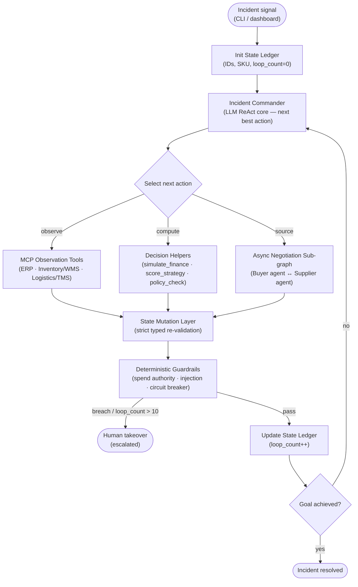

# OSCAR — Operational Supply Chain Autonomous Responder

> An enterprise AI agent that takes ownership of a critical procurement incident and drives it to resolution — assessing exposure, choosing the feasible-and-optimal mitigation, negotiating a purchase order, and enforcing spend authority — escalating to a human only when a decision genuinely exceeds its delegated authority.

---

## The Problem

Procurement incident response is reactive and fragmented. When a shipment slips, the signals that decide the right response are scattered across ERP, warehouse, and logistics systems, and the resolution path depends on numbers no one has assembled yet — how large the shortfall is, how many days production can survive, what internal stock and air capacity exist, and what price alternate vendors will actually agree to. By the time a human stitches these together, penalties are accruing and a plant is closer to shutdown.

**The incident OSCAR owns:** a shipment of component `SKU-99` from primary supplier `SUP-A` (PO `PO-88123`) has slipped its contracted arrival date. `PLANT-2` holds only a razor-thin inventory buffer, so the delay threatens a **production shutdown** and mounting **contractual penalties**.

## The Solution — and Why an Agent

OSCAR resolves the incident end-to-end:

1. **Assess** the operational and financial exposure from live enterprise signals.
2. Evaluate every mitigation route and choose the one that is both **feasible** and **optimal**.
3. **Negotiate** a purchase order with alternate vendors when sourcing is required.
4. **Enforce spend authority** — and escalate to a human only when the spend exceeds its delegated limit.

This is agentic, not a workflow. The resolution path is **not a fixed script**: it emerges from the signals OSCAR gathers turn by turn. OSCAR reasons over those signals in a closed ReAct (Reason + Act) loop, selects tools, interprets their results, and converges on a decision — the internal-stock, air-expedite, or alternate-supplier route emerges from the numbers rather than being hard-coded.

---

## Architecture at a Glance

An incident signal initializes the **State Ledger** (the single source of truth). The **Incident Commander** then runs its ReAct loop, selecting one action per turn from three capability groups — **MCP Observation Tools**, deterministic **Decision Helpers**, and the asynchronous **Negotiation sub-graph**. Every result flows back through the **State Mutation Layer** (typed re-validation) and then the **Deterministic Guardrails**, which either update the ledger and loop again, or escalate to a human.



Two presentation surfaces — a Streamlit cockpit (`dashboard.py`) and a terminal CLI (`agent_cli.py`) — observe this loop through an observational event stream without altering its control flow.

**Full design detail (diagrams, tool contracts, formulas, worked examples) lives in [`docs/ARCHITECTURE_DESIGN.md`](docs/ARCHITECTURE_DESIGN.md).**

---

## Setup

Requires **Python 3.12**.

```bash
# 1. Clone
git clone https://github.com/Beesettyrakesh/Autonomous-Supply-Chain-Incident-Commander.git
cd Autonomous-Supply-Chain-Incident-Commander

# 2. Create and activate a virtual environment
python3.12 -m venv .venv
source .venv/bin/activate

# 3. Install dependencies
.venv/bin/python -m pip install -r requirements.txt
```

Create a `.env` file in the repo root for the **live** reasoning core (placeholders only — never commit real secrets):

```dotenv
GEMINI_API_KEY=YOUR_API_KEY
GEMINI_MODEL=gemini-2.5-flash
```

> **No key required to try it.** OSCAR ships with a deterministic offline planner and scripted vendor, so the entire agent runs end-to-end without any API key. Force offline mode by leaving the key empty: `GEMINI_API_KEY=""`.

---

## Run — Dashboard (Incident Command Center)

```bash
.venv/bin/streamlit run dashboard.py
```

The cockpit defaults to the **Offline** deterministic planner (zero cost). Flip the **Live** toggle to engage the real Gemini reasoning core, which also runs the Observation Tools over the **real MCP protocol** (stdio) against the three category servers.

---

## Run — CLI (Agent Console)

The terminal console drives the same autonomous ReAct loop with colorized step narration and an interactive human-in-the-loop spend gate.

### The four canonical demo commands

```bash
# 1. Autonomous, deterministic — small order resolves via internal transfer ($0 spend)
.venv/bin/python agent_cli.py --qty 300 --hitl approve

# 2. Human-in-the-loop, deterministic — large over-authority order prompts for approval
.venv/bin/python agent_cli.py --qty 500 --hitl prompt

# 3. Autonomous, LIVE — real Gemini core + real stdio MCP servers
.venv/bin/python agent_cli.py --qty 300 --hitl approve --live

# 4. Human-in-the-loop, LIVE — negotiation → spend breach → human approve/reject
.venv/bin/python agent_cli.py --qty 500 --hitl prompt --live
```

> `--live` engages the live Gemini reasoning core **and spawns the three MCP servers as subprocesses, reaching every Observation Tool over stdio** — this uses your API quota. Without `--live`, OSCAR runs the deterministic offline planner and in-process tools at zero cost.

### Discover every option

```bash
.venv/bin/python agent_cli.py --help
```

### All CLI options

| Flag | Default | Purpose |
|---|---|---|
| `--qty` | `500` | Order quantity — the single lever the strategy emerges from: `≤350` → INTERNAL_TRANSFER · `351–420` → AIR_FREIGHT · `>420` → ALT_SUPPLIER. Also sets total spend (`unit price × qty`) vs the $20k authority. |
| `--delay` | `9` | Observed shipment delay (days) — the second, independent lever. Drives the **dynamic projected loss**, not the strategy choice. |
| `--surplus` | `350` | Internal transfer surplus (units PLANT-1 can spare). Gates INTERNAL_TRANSFER feasibility. |
| `--air-capacity` | `420` | Finite air cargo capacity (units). Gates AIR_FREIGHT feasibility. |
| `--hitl` | `prompt` | How to resolve an over-limit spend breach: `prompt` (interactive y/N) · `approve` · `reject` (non-interactive verdicts for scripts/CI). |
| `--live` | off | Engage the live Gemini core + real stdio MCP (uses API quota). Default is the zero-cost deterministic offline planner. |
| `--spend-limit` | `20000` | Override the delegated spend-authority limit in USD. |
| `--no-color` | off | Disable colored output (useful when piping to a file or CI log). |
| `--json` | off | Print the final State Ledger as JSON at the end (audit / architecture proof). |

### Custom-lever examples

```bash
# Force the AIR_FREIGHT rung (surplus exhausted, still within air capacity)
.venv/bin/python agent_cli.py --qty 400 --hitl approve

# ALT_SUPPLIER within authority — negotiate a PO, then dump the final ledger
.venv/bin/python agent_cli.py --qty 440 --hitl approve --json

# Larger delay (bigger loss) + a rejected over-limit spend → incident escalated
.venv/bin/python agent_cli.py --qty 500 --delay 12 --hitl reject
```

---

## Demo Scenarios (real, reproducible metrics)

The agent's strategy **emerges** from the order quantity vs the incident's finite resources (internal surplus `350`, air capacity `420`, $20,000 spend authority). The shipment delay independently drives the projected loss — at the baseline `--delay 9`, the exposure is **$357,750** (daily penalty $2,250).

| Order qty | Emergent strategy | Spend | Outcome |
|---:|---|---:|---|
| `300` | **INTERNAL_TRANSFER** | $0 | Internal surplus covers the shortfall — resolved at zero external spend. |
| `400` | **AIR_FREIGHT** | — | Surplus exhausted; finite air capacity still fits — expedite by air. |
| `440` | **ALT_SUPPLIER** | $19,360 | Negotiated PO with **SUP-C @ $44.00/unit** (beating SUP-B @ $46.75); within authority → auto-resolved. |
| `500` | **ALT_SUPPLIER + HITL** | $22,000 | Spend exceeds the $20k authority → escalates to a human: **approve → resolved**, **reject → escalated** (terms nulled, no PO). |

(Negotiation winner emerges from per-vendor floors; the buyer opens at **$42.08** and settles with the lowest-cost supplier.)

---

## Testing

The full suite runs offline — no API key, deterministic planner, scripted vendor, in-process MCP transport:

```bash
GEMINI_API_KEY="" VENDOR_MODE=deterministic .venv/bin/python -m pytest -q
# → 51 passed
```

**51 tests across 9 modules** cover the schema/Literal locks, the State Mutation Layer, the five MCP tools and the three-server split, the Decision Helper formulas, the guardrails, the negotiation state machine, the feasibility ladder + HITL paths, the CLI, and the resilience/retry policy. This includes a **real MCP client↔server integration test** that spawns all three servers and invokes their tools over stdio.

---

## Security

Every barrier is deterministic and code-enforced — the LLM has **no control** over them:

- **Spend authority + human-in-the-loop.** Any purchase over the delegated $20,000 authority is hard-forked to a human approve/reject decision; the model cannot approve its own over-limit spend.
- **Recursive prompt-injection sanitization.** Every value bound for a write is scanned (recursing through nested dicts/lists) against prompt-injection, role-tag, shell-metacharacter, and command-substitution patterns; a hit becomes a recoverable error Observation, not a compromised action. Untrusted supplier replies are scanned before parsing and again before reaching the ledger.
- **Log-forging defense.** Control characters (CR/LF/ESC/DEL and other C0 bytes) are stripped at the single log-write boundary, so adversarial input can't inject fake log lines or corrupt the terminal.
- **Code-owned state.** Guardrail status, goal-achieved, and escalation reason are written only by guardrail/orchestrator code — never authorable by the LLM.

---

## Engineering Choices

OSCAR is built directly on the `google-genai` SDK. This is a deliberate architectural bypass of higher-level frameworks like the ADK, providing absolute, low-level control over the ReAct loop, the typed State Mutation Layer, and the execution of deterministic guardrails. Furthermore, the supplier negotiation utilizes a custom, asynchronous agent-to-agent channel. By running isolated LLM-driven agents in-process rather than relying on external networked agent-card protocols, the system eliminates network latency and guarantees synchronized state validation during the critical 3-turn negotiation loop.

---

## Further Reading

- **[`docs/ARCHITECTURE_DESIGN.md`](docs/ARCHITECTURE_DESIGN.md)** — full architecture, Mermaid diagrams, tool contracts, Decision-Helper formulas with worked examples, the feasibility ladder, negotiation sub-graph, security model, and testing matrix.
