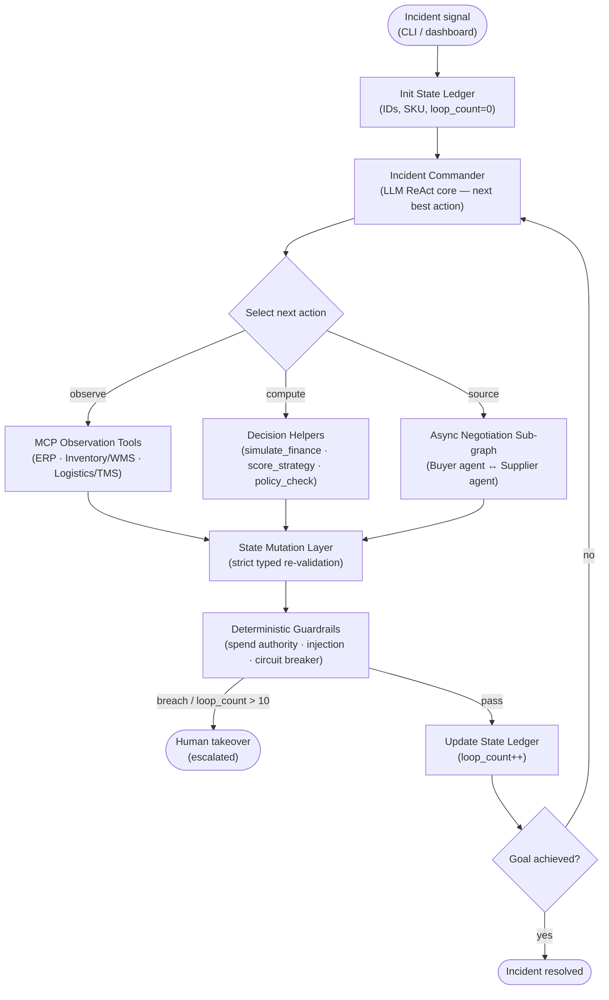
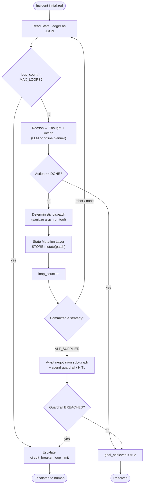
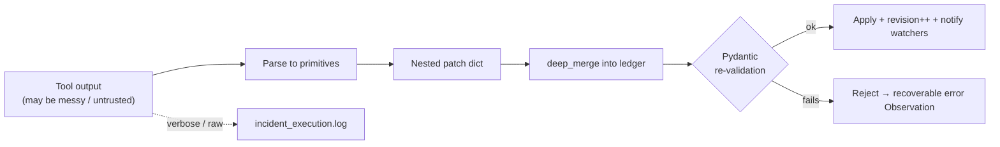
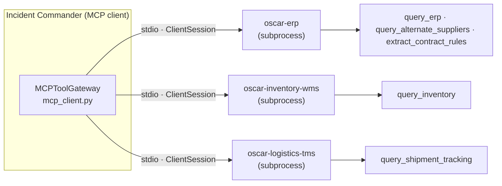
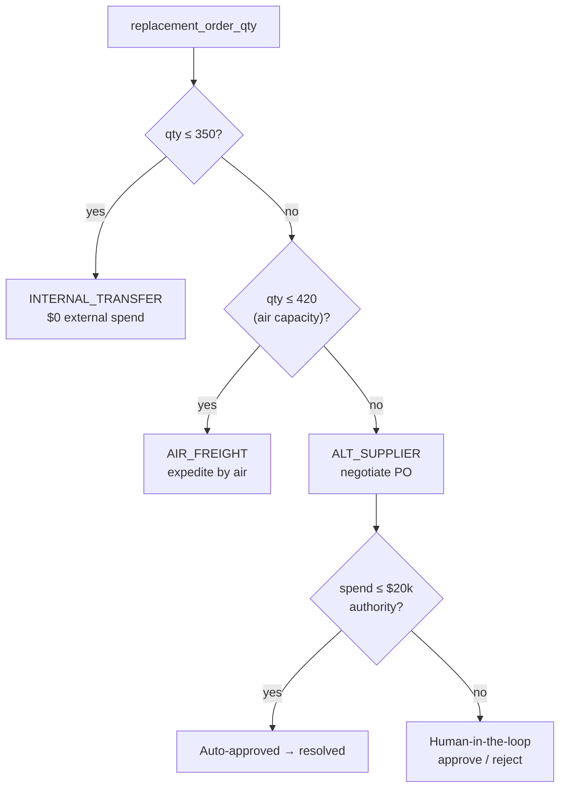
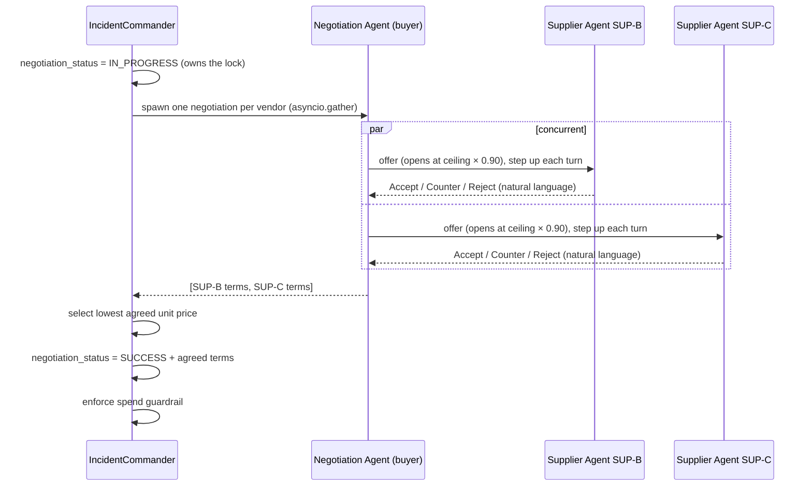
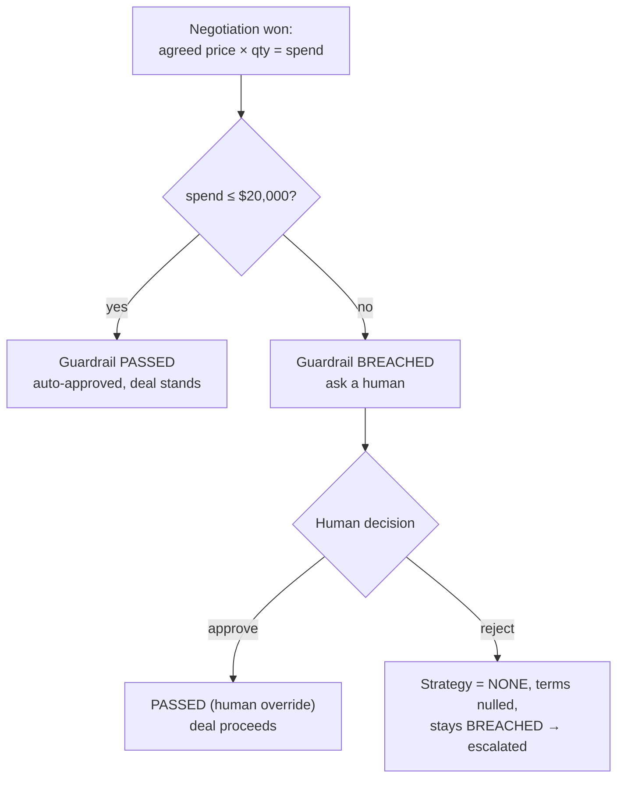

# OSCAR — Architecture & Design

**OSCAR — Operational Supply Chain Autonomous Responder**

---

## 1. Overview

OSCAR is an enterprise agent that takes ownership of a single, high-stakes procurement incident and drives it to resolution — or to a clean human hand-off — without a human in the control loop for routine decisions.

**The incident.** A shipment of component `SKU-99` from primary supplier `SUP-A` (PO `PO-88123`) has slipped its contracted arrival date. `PLANT-2` holds only a razor-thin inventory buffer, so the delay threatens a production shutdown and mounting contractual penalties. OSCAR must assess the exposure, evaluate every mitigation route, choose the one that is both *feasible* and *optimal*, execute it (including negotiating a purchase order with alternate vendors), and enforce spend authority — escalating to a human only when a decision genuinely exceeds its delegated authority.

**Why an agent.** The resolution path is not a fixed script. It depends on live signals — how large the shortfall is, how many days the shipment has slipped, what internal stock and air capacity exist, and what price alternate vendors will agree to. OSCAR reasons over these signals turn by turn, selects tools, interprets their results, and converges on a decision. That is agentic behaviour, not a workflow.

---

## 2. System Diagram

OSCAR follows a single, code-enforced execution topology. An incident signal initializes the **State Ledger**; the **Incident Commander** then runs its ReAct loop, selecting one action per turn from three capability groups — **MCP Observation Tools**, deterministic **Decision Helpers**, and the asynchronous **Negotiation sub-graph**. Every tool result flows back through the **State Mutation Layer** (typed re-validation) and then the **Deterministic Guardrails**, which either update the ledger and loop again, or escalate to a human. Components never pass data ad-hoc — all state changes are mediated by the ledger.



Two presentation surfaces — a Streamlit cockpit (`dashboard.py`) and a terminal CLI (`agent_cli.py`) — observe this loop through an observational event stream without altering its control flow. Every arrow into the ledger passes through the State Mutation Layer; nothing reaches it without Pydantic re-validation, and verbose or untrusted payloads are routed to the isolated `incident_execution.log`.


---

## 3. The ReAct Loop

The Incident Commander runs a closed **Re**ason + **Act** loop. Each turn it reads the serialized State Ledger, emits a `Thought` and an `Action`, dispatches the chosen tool deterministically, commits the parsed result through the State Mutation Layer, increments the loop counter, and checks the circuit breaker.



**Reasoning parity.** The loop is identical whether reasoning is powered by a live Gemini core or the deterministic offline planner. When `GEMINI_API_KEY` is unset (or the SDK is absent), `_reason_offline` walks the same information-gathering order a well-behaved model follows — parse contract, quantify finance, score every candidate, commit the best feasible strategy — so the entire loop is exercisable end-to-end in CI without an API key.

**Memory.** A running ReAct *scratchpad* (prior Thought / Action / Observation turns) is injected into every live reasoning call so the model remembers what it already did and converges instead of repeating actions. The Observation step — feeding real tool output back into context — is what turns blind repetition into grounded reasoning.

**Robust parsing.** Live model output is parsed defensively: a multi-line `Thought` is captured, and the `Action` JSON is isolated with a fence-tolerant, brace-matching extractor so a valid tool call is never silently downgraded to `DONE`.

---

## 4. State Ledger & the State Mutation Layer

### The ledger

The **State Ledger** (`schema.py`) is the single source of truth. It is a hierarchical Pydantic model the Incident Commander reasons over each turn. Its five sections are:

| Section | Responsibility |
|---|---|
| `IncidentMetadata` | Identity, type, severity, and the `loop_count` lifecycle counter. |
| `BusinessContext` | The enterprise entities the incident anchors to (SKU, supplier, PO, contract) plus the parsed penalty rate. |
| `ImpactMetrics` | Quantified operational + financial exposure and the mitigation feasibility signals. |
| `MitigationState` | Active strategy, per-strategy scores, negotiation status, and agreed terms. |
| `SystemStatus` | Guardrail status, goal-achieved flag, escalation reason — owned by code, never writable by the LLM. |

**Literal fields lock each field to a finite state set.** Strategy names, statuses, and severities are `Literal` types, so the model cannot invent an out-of-schema value such as `"EXPEDITE"`. The schema itself participates in circuit-breaking: `loop_count` is hard-bounded (`ge=0`, `le=11`), so a runaway loop cannot even be represented.

### The State Mutation Layer

All writes flow through `LedgerStore` (`ledger_store.py`), the deterministic enforcement point:

- **Typed-primitives-only.** `mutate()` deep-merges a partial patch, then re-validates the *entire* merged object through the Pydantic model. Any value that violates a type or `Literal` constraint raises, and the mutation is rejected — a rejected mutation becomes a recoverable error Observation rather than a crash.
- **Auditability.** Every accepted mutation increments a `revision` counter.
- **Isolation.** `snapshot()` returns a deep copy, so a consumer mutating its snapshot can never corrupt canonical state. Watchers registered via `on_mutation` also receive deep copies.
- **Raw-detail quarantine.** Verbose or untrusted tool output never enters the ledger; it is appended to `incident_execution.log` via `append_raw_log()` (with an async variant for use inside the concurrent negotiation sub-graph).



---

## 5. MCP Tool Ecosystem

OSCAR reaches its Observation Tools as a genuine **Model Context Protocol client**. The tools live behind **three separate MCP servers** — one per enterprise system — mirroring how a real organization fronts ERP, warehouse, and transportation systems as distinct services rather than one monolith. Each server is an independent FastMCP application with its own name, its own registered tools, and its own runnable entry point:

| MCP server (FastMCP app) | Server name | Tools |
|---|---|---|
| `erp_server.py` (`erp_app`) | `oscar-erp` | `query_erp`, `query_alternate_suppliers`, `extract_contract_rules` |
| `inventory_server.py` (`inventory_app`) | `oscar-inventory-wms` | `query_inventory` |
| `logistics_server.py` (`logistics_app`) | `oscar-logistics-tms` | `query_shipment_tracking` |



**Real client ↔ server over stdio.** When the agent runs live, the `MCPToolGateway` (`mcp_client.py`) launches each server as its **own subprocess** (`python -m mcp_servers.erp_server`, etc.), opens an MCP `ClientSession` over stdio, calls `initialize()` / `list_tools()`, and invokes each Observation Tool with `call_tool(name, args)` — the genuine MCP request/response wire. Each server is also independently runnable and could be hosted as a standalone service.

**Dual transport, one tool surface.** A `MCP_TRANSPORT` switch selects how the tools are reached without changing the call sites: `stdio` (the real client↔server protocol, used for the live demo) or `inproc` (the same tool functions called directly in-process). The in-process transport is the deterministic default for the offline test suite and CI — it removes subprocess/LLM nondeterminism while exercising the identical tool contract, so the frozen numbers are transport-independent. This is an explicit engineering trade-off: the protocol path proves real MCP, the in-process path keeps the offline suite fast and reproducible (the capstone does not require live deployment for judging).

**Shared tool contract.** Every tool across all three servers obeys the same contract: accept strictly-typed scalar inputs; return strictly-typed, JSON-serializable dicts (never raw prose or markdown); and push verbose/raw source payloads to `incident_execution.log`, not into the return value. Only the Observation Tools are MCP tools — the Decision Helpers (Section 6) are deterministic local math and run in-process by design.


---

## 6. Decision Helpers

The reasoning core is **physically forbidden** from computing financial impact or strategy scores in prose — it must delegate to these pure, deterministic functions so results are reproducible and auditable (`decision_helpers.py`).

### `simulate_finance` — a formula, not a constant

The projected loss is **computed from the ledger**, and it scales with the *delay lever*. Downtime only begins once the on-hand inventory buffer is exhausted:

```
daily_penalty      = revenue_at_risk × contracted_penalty_rate
penalty_component  = daily_penalty × delay_days
shutdown_days      = max(0, delay_days − inventory_days_remaining)
downtime_component = (revenue_at_risk / production_shutdown_hours) × 24 × shutdown_days
projected_loss     = revenue_at_risk + penalty_component + downtime_component
```

For the seeded incident — `revenue_at_risk = $75,000`, penalty rate `3.0%/day` (parsed from the contract), a 2-day inventory buffer, and a 48-hour shutdown basis — the loss **moves with the delay**:

| `delay_days` | daily penalty | projected total loss |
|---:|---:|---:|
| 5 | $2,250 | **$198,750** |
| 9 (baseline) | $2,250 | **$357,750** |
| 12 | $2,250 | **$477,000** |

The delay is a live dashboard/CLI lever, so this figure is dynamic — change the delay and the exposure recomputes. The daily penalty is constant because it depends on the (fixed) revenue basis and contract rate, not on the delay.

### `score_strategy` — a transparent weighted rubric

The composite score is a deterministic three-factor rubric, not an LLM judgement. Each strategy starts from a fixed **base profile** (cost / speed / reliability, each 0–100), which is then adjusted by live ledger signals and combined with fixed weights:

```
cost_score = base_cost / market_freight_index          # freight-market pressure (index 1.0 here)
time_score = base_speed × urgency                       # urgency = 1 + max(0, 3 − inventory_days_remaining) × 0.05
risk_score = base_reliability × severity_discount       # LOW 1.00 · MEDIUM 0.95 · HIGH 0.90 · CRITICAL 0.85
composite  = 0.35 × cost_score + 0.40 × time_score + 0.25 × risk_score
```

The weights encode business priority for a time-critical incident: **time is weighted highest (0.40)**, then **cost (0.35)**, then **risk (0.25)**. The modifiers make the score *react to live state* — a shrinking inventory buffer raises urgency, a higher freight index erodes cost, and a more severe incident discounts reliability.

**Base profiles and the worked composite** for the seeded incident (freight index `1.0`; inventory 2 days → urgency `1.05`; severity CRITICAL → discount `0.85`):

| Strategy | base cost / speed / reliability | cost | time (`×1.05`) | risk (`×0.85`) | composite |
|---|---|---:|---:|---:|---:|
| INTERNAL_TRANSFER | 90 / 75 / 80 | 90.00 | 78.75 | 68.00 | **80.00** |
| AIR_FREIGHT | 30 / 95 / 70 | 30.00 | 99.75 | 59.50 | **65.28** |
| ALT_SUPPLIER | 70 / 55 / 60 | 70.00 | 57.75 | 51.00 | **60.35** |

For example, INTERNAL_TRANSFER: `0.35×90 + 0.40×78.75 + 0.25×68 = 31.5 + 31.5 + 17.0 = 80.00`. The scores are reproducible from the ledger every run.

Scoring only *records* a rating — it does **not** select the strategy. Selection is gated separately by feasibility (Section 7).


### `policy_check`

A boolean compliance gate: the supplier must be an approved vendor **and** the spend must fall within the delegated per-transaction authority. The spend-authority guardrail wraps this as its single source of truth (Section 9).

---

## 7. Evaluate-vs-Commit & the Feasibility Ladder

OSCAR separates **desirability** (the score) from **feasibility** (can this option actually be executed for this incident?). A strategy may score highest and still be impossible — so the agent must never commit an infeasible option regardless of its score.

Feasibility is decided by comparing the required `replacement_order_qty` against the incident's **finite resources**:

- **INTERNAL_TRANSFER** is feasible only if the sister site's transferable surplus covers the full replacement quantity.
- **AIR_FREIGHT** is feasible only if the lane is open **and** the carrier's finite air cargo capacity covers the quantity. *A large order can exceed available air capacity — in which case air freight cannot be executed no matter how attractive its speed score is. This is a capacity constraint, never a cost decision.*
- **ALT_SUPPLIER** is always feasible — the approved alternate-vendor pool is a standing sourcing path.

Because the highest-scoring option is `INTERNAL_TRANSFER` (80.00), the agent's choice is driven by whether the order quantity fits the finite resources. This produces a natural escalation ladder as the order grows:

| Order quantity | Feasible outcome | Spend | Path |
|---:|---|---:|---|
| ≤ 350 | INTERNAL_TRANSFER | $0 | Internal surplus (350 units) covers the shortfall. |
| 351 – 420 | AIR_FREIGHT | — | Surplus exhausted; finite air capacity (420 units) still fits. |
| 421+, ≤ $20k (e.g. 440 → $19,360) | ALT_SUPPLIER | within authority | Auto-approved; negotiate a PO. |
| 500 → $22,000 > $20k | ALT_SUPPLIER + HITL | over authority | Escalates to a human: approve → resolved; reject → escalated. |



The commander enforces this in three aligned places so a live model that ignores the prompt cannot drive an impossible action: the offline planner's selection, the `SYSTEM_PROMPT` feasibility rules, and a hard `commit_strategy` backstop that blocks an infeasible commit and returns a recoverable error — which is exactly what organically routes a large-shortfall incident to `ALT_SUPPLIER`.

**Commit is terminal.** Committing a valid strategy is the resolving action; there is no extra `DONE` turn. Committing `ALT_SUPPLIER` hands off to the negotiation sub-graph as part of the same turn.

---

## 8. Asynchronous Negotiation Sub-graph

When the agent commits `ALT_SUPPLIER`, it hands off to a genuine agent-to-agent negotiation (`negotiation_agent.py`): OSCAR's **Negotiation Agent** (the buyer) bargains with an independent **Supplier Agent** over price and lead time. The supplier is itself an agent — in live mode a *second Gemini LLM* with its own system prompt, its own walk-away floor price, and its own authority to Accept / Counter / Reject. One negotiation runs per alternate vendor, concurrently.




Design points:

- **Two autonomous agents.** The Supplier Agent replies `Accept` / `Counter` / `Reject` in natural language, driven by its own floor price; the Negotiation Agent parses that messy text into strict primitives and counters. For the offline demo the supplier runs in a deterministic scripted mode (`VENDOR_MODE=deterministic`) so the negotiation is reproducible and costs no API quota — the *same* parsing and bargaining path executes in both modes. Only the parsed scalars reach the ledger; raw dialogue goes to the execution log.
- **Turn-limited state machine.** A hard `MAX_TURNS = 3` caps bargaining volleys; no agreement by the last turn → `FAILED`. The buyer opens ~10% under its willingness-to-pay ceiling and steps up toward it each turn.
- **Per-vendor floors.** Each Supplier Agent negotiates against its own true unit cost, so quotes differ and a meaningful lowest-price winner emerges. For the seeded incident: **SUP-C settles at $44.00/unit on a 6-day lead** while **SUP-B holds at $46.75/8-day**, so SUP-C is the loss-minimizing winner. The buyer's opening offer is derived from its own economics (primary unit cost × acceptable premium), opening at **$42.08** (`$46.75 × 0.90`).
- **Isolated turn counter.** The sub-graph counts its own volleys and never calls `STORE.increment_loop()` — to the orchestrator the whole negotiation is one loop.
- **Concurrency-safe status.** Under the concurrent `gather`, each coroutine runs with `write_status=False`; the orchestrator holds the master status lock and writes the single final `SUCCESS`/`FAILED` after selecting the winner. `gather(return_exceptions=True)` means a single vendor failure is logged and dropped rather than aborting the batch.
- **Observational transcript.** The chat bubbles shown in the cockpit/CLI are a clean *sequential reconstruction* from the real agreed numbers; the live sub-graph bargains concurrently. The transcript never changes the outcome.

> **Communication model.** This is agent-to-agent negotiation between two LLM-driven agents over a custom asyncio channel. It is deliberately *not* framed as Google's formal A2A protocol — there are no agent cards or `RemoteA2aAgent` transports here. Promoting the supplier to a networked A2A-protocol service is a natural next step (see §15, Future Work).


---

## 9. Security

Security barriers are deterministic and code-enforced — the LLM has no control over them.

- **Log-forging defense.** `append_raw_log` strips C0 control characters (`0x00–0x1f`, including CR/LF/ESC) plus DEL before writing. This is applied at the single write boundary, so every call site is protected against log-line injection and terminal-escape corruption from adversarial input.
- **Recursive injection sanitization.** `sanitize_write_payload` scans every value bound for a write action against a battery of prompt-injection, role-tag, shell-metacharacter, command substitution, and hex-escape patterns. It recurses through dicts (values *and* stringified keys) and lists/tuples — closing the bypass of smuggling an override as a nested list element. A hit raises `InjectionAttemptError`, which the orchestrator converts into a recoverable error Observation (the write is aborted, the loop continues safely).
- **Untrusted vendor replies.** Every Supplier Agent reply — untrusted secondary-LLM output — is scanned before parsing, and the whole negotiated outcome is scanned again before it can flow into the ledger. A hit downgrades that vendor to `FAILED` (log + drop).

- **Length boundaries.** System identifiers use a strict `MAX_WRITE_STRING_LEN = 100`; genuine natural-language fields (a vendor reply) use a looser `MAX_NL_STRING_LEN = 500`. The injection regex always runs regardless of the length bound, so the looser NL allowance never weakens content detection.
- **State ownership.** `SystemStatus` (guardrail status, goal, escalation reason) is written only by guardrail/orchestrator code — the LLM cannot author these fields.

---

## 10. Human-in-the-Loop (Spend Authority)

Once a negotiation wins, the deal is checked against the agent's **delegated spend authority** before it is treated as resolved. Spend is `agreed_unit_price × order_quantity`, compared against the fixed `$20,000` authority limit.



- **Sync-or-async provider.** The human-decision callable may be synchronous or asynchronous; the orchestrator awaits it transparently via `inspect.isawaitable`. The CLI injects a plain sync prompt; the dashboard injects an async bridge (an `asyncio.Event` resolved with `call_soon_threadsafe`) so the UI never blocks the event loop.
- **Reject leaves no phantom PO.** A rejection clears `active_strategy` to `NONE`, sets `negotiation_status = FAILED`, and **nulls the negotiated terms** — otherwise a cancelled purchase would strand a phantom PO in the single source of truth. The incident stays `BREACHED` and is escalated for manual handling.
- **The LLM has no say.** This barrier sits after the reasoning loop; the model cannot approve its own over-limit spend.

---

## 11. Resilience

- **Shared retry policy.** Both the Incident Commander and the Supplier Agent route their Gemini calls through `generate_with_retry` (`llm_utils.py`), so both obey one transient-error policy: bounded exponential backoff on 429 (per-minute rate) and 5xx errors, plus `httpx` transport errors (dropped connection / timeout), honoring the server's suggested `RetryInfo.retryDelay` when present (capped).

- **Daily quota escalates immediately.** A per-**day** quota exhaustion cannot recover by waiting, so it is *not* retried — it raises `LLMUnavailableError` and the caller escalates cleanly.
- **Clean human takeover.** If the reasoning core is unreachable, the loop escalates to a human (`llm_quota_exhausted`) instead of leaking a raw SDK traceback — the correct enterprise failure mode.
- **Concurrency-safe.** The negotiation `gather` uses `return_exceptions=True` so one vendor's failure never aborts the batch, and async log writes keep the event loop free during concurrent vendor calls.
- **Non-crashing tool dispatch.** Bad tool arguments, unknown tools, out-of-schema strategy names, and rejected mutations all degrade to recoverable error Observations rather than crashing the loop.

---

## 12. Course-Concept Mapping

OSCAR implements **four** of the capstone's course concepts, all in code.

| Course concept | How OSCAR implements it | Where |
|---|---|---|
| **Multi-agent system** | A custom ReAct reasoning agent (the Incident Commander) plus an asynchronous agent-to-agent negotiation between a Buyer agent and independent Supplier agents, run concurrently across vendors. | `orchestrator.py`, `negotiation_agent.py` |
| **MCP Server** | Three independent MCP servers (ERP, Inventory/WMS, Logistics/TMS) built on FastMCP, reached by a real MCP client (`MCPToolGateway`) over stdio, exposing five tools under a shared typed contract. | `mcp_servers/`, `mcp_client.py` |
| **Security** | Log-forging defense, recursive prompt-injection sanitization, untrusted-vendor-reply scanning, length boundaries, and code-owned state fields. | `guardrails.py`, `ledger_store.py` |
| **Agent CLI** | An argparse terminal console driving the same async ReAct loop with colorized step narration and an interactive HITL spend gate. | `agent_cli.py` |

OSCAR is built directly on the `google-genai` SDK, giving full control over the ReAct loop, the State Mutation Layer, and the guardrails. Every metric in this document is a real, reproducible output of the code.

---

## 13. Repository Map

```
.
├── schema.py                  # StateLedger Pydantic model (single source of truth)
├── ledger_store.py            # LedgerStore / STORE — State Mutation Layer + raw-log sink
├── orchestrator.py            # IncidentCommander — async ReAct loop, feasibility gate, HITL
├── mcp_client.py              # MCP client gateway (stdio ClientSession + in-process invoker)
├── decision_helpers.py        # simulate_finance, score_strategy, policy_check (deterministic)
├── negotiation_agent.py       # async agent-to-agent negotiation sub-graph (Buyer ↔ Supplier)
├── guardrails.py              # spend-authority + injection sanitization barriers
├── llm_utils.py               # generate_with_retry + LLMUnavailableError (shared resilience)
├── mcp_servers/               # 3 independent MCP servers (FastMCP)
│   ├── __init__.py            #   package re-exports
│   ├── erp_server.py          #   oscar-erp: query_erp, query_alternate_suppliers, extract_contract_rules
│   ├── inventory_server.py    #   oscar-inventory-wms: query_inventory
│   └── logistics_server.py    #   oscar-logistics-tms: query_shipment_tracking
├── tools/
│   └── mock_data.py           # deterministic ERP / inventory / shipment datasets (SKU-99)
├── dashboard.py               # Streamlit cockpit (observational)
├── agent_cli.py               # terminal operator console (Agent CLI)
├── contract_CTR-4471.txt      # supplier contract (3.0% per-diem penalty clause)
├── tests/                     # 51 offline pytest tests across 9 modules
└── docs/
    └── ARCHITECTURE_DESIGN.md # this document
```

---

## 14. Testing

OSCAR ships with **51 offline tests** across **9 modules**, all runnable without an API key (deterministic planner + scripted vendor + in-process MCP transport).

| Module | Tests | Covers |
|---|---:|---|
| `test_schema.py` | 6 | Ledger validation, Literal locks, `loop_count` bounds. |
| `test_ledger_store.py` | 5 | Mutation re-validation, deep-copy snapshots, revision counter, raw-log sanitization. |
| `test_mcp_tools.py` | 7 | The 5 tools and the 3-server split. |
| `test_mcp_client.py` | 3 | Real MCP client↔server over stdio + in-process invoker + end-to-end run over stdio. |
| `test_decision_helpers.py` | 8 | `simulate_finance` formula, `score_strategy` outputs, `policy_check`. |
| `test_guardrails.py` | 6 | Spend-authority outcomes and recursive injection sanitization. |
| `test_negotiation.py` | 4 | Turn-limited state machine, per-vendor floors, outcome parsing. |
| `test_orchestrator_paths.py` | 6 | Feasibility ladder, commit backstop, HITL approve/reject paths. |
| `test_cli.py` | 3 | CLI exit codes and rendering. |
| `test_resilience.py` | 3 | Retry policy, daily-quota escalation, transport-error handling. |

**Run the suite (offline):**

```bash
GEMINI_API_KEY="" VENDOR_MODE=deterministic .venv/bin/python -m pytest -q
# → 51 passed
```

**Verify the agent end-to-end (offline):**

```bash
# Autonomous internal transfer (small order)
GEMINI_API_KEY="" VENDOR_MODE=deterministic .venv/bin/python agent_cli.py --qty 300 --hitl approve --no-color

# Alternate-supplier negotiation + HITL escalation (large order)
GEMINI_API_KEY="" VENDOR_MODE=deterministic .venv/bin/python agent_cli.py --qty 500 --hitl approve --no-color
```

The live demo (`--live`) additionally exercises the real MCP protocol: it spawns the three servers as subprocesses and reaches every Observation Tool over stdio via an MCP `ClientSession`.

---

## 15. Future Work

- **A2A-protocol suppliers.** Promote each Supplier Agent to a standalone service that publishes an agent card and is reached over a networked agent-to-agent protocol, so vendors can be discovered and negotiated with across a real registry rather than in-process.
- **Persistent incident store.** Back the State Ledger with a durable store so incidents survive process restarts and support post-incident audit queries.
- **Live enterprise connectors.** Replace the mock ERP / WMS / TMS datasets behind the MCP servers with real system integrations while keeping the same tool contract.

